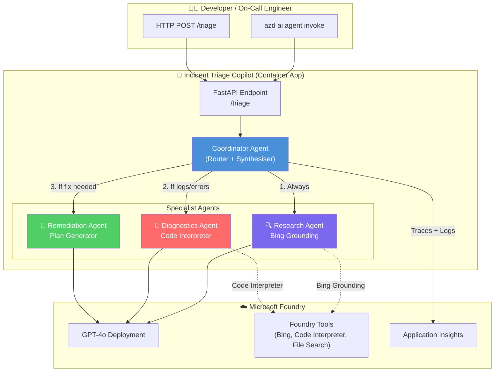
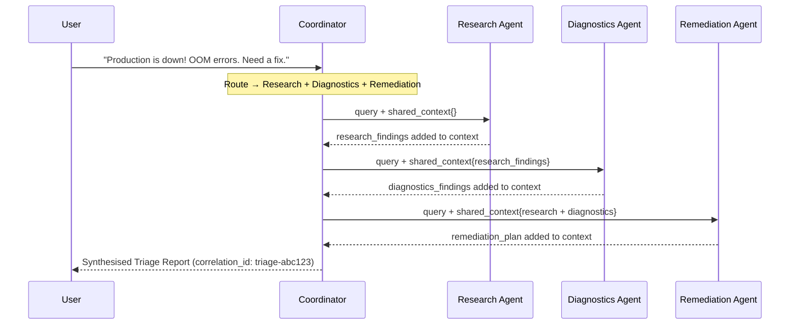
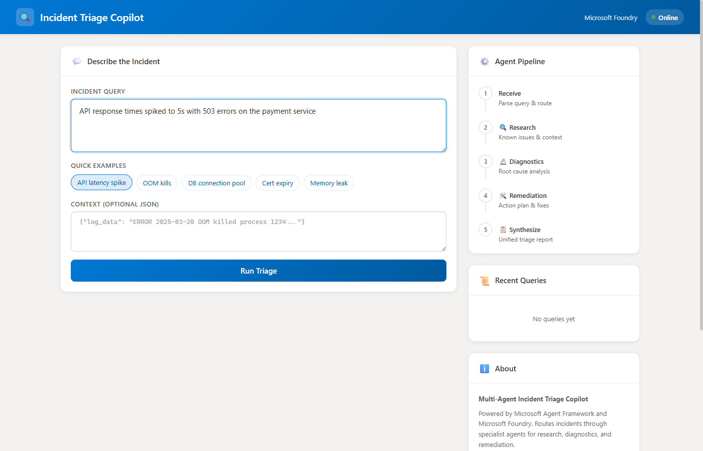
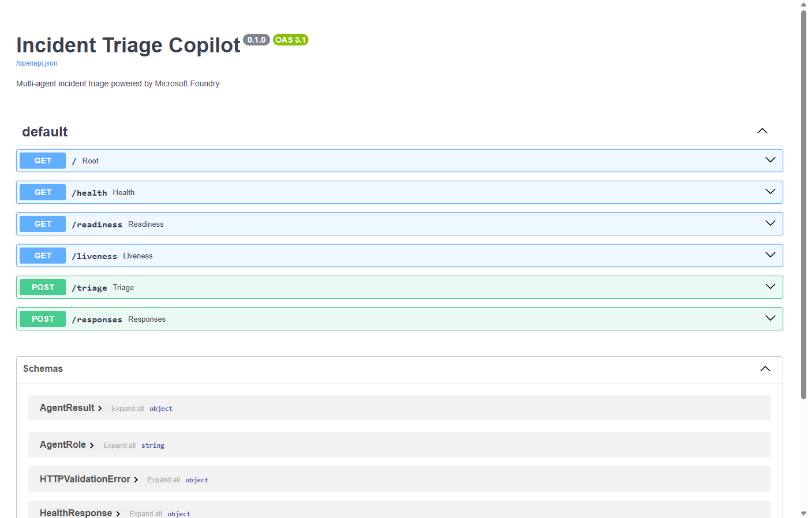
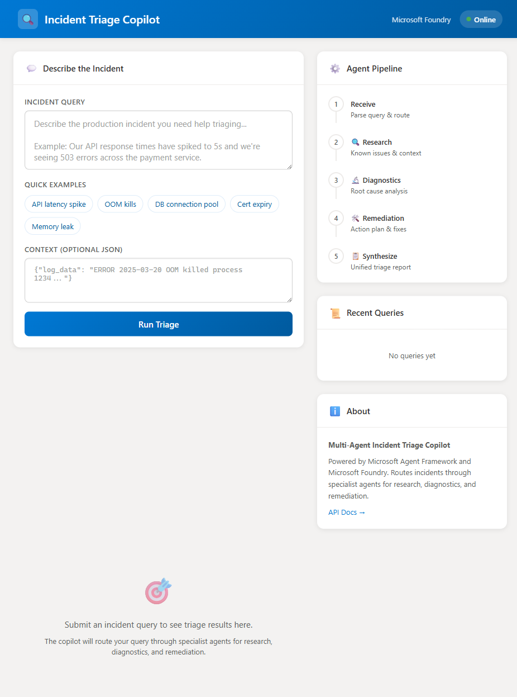

# Multi-Agent Incident Triage Copilot

[](https://learn.microsoft.com/azure/developer/azure-developer-cli/)
[](https://www.python.org/downloads/)
[](LICENSE)
[](https://learn.microsoft.com/azure/ai-foundry/)
[](https://learn.microsoft.com/azure/ai-services/agents/)
[](https://www.docker.com/)
[](https://fastapi.tiangolo.com/)
[](.)
[](.)

A production-ready sample showing how to build, test, and deploy a **multi-agent AI system** using the **Azure Developer CLI (`azd`) AI agent extension** and **Microsoft Agent Framework**, hosted on **Microsoft Foundry Hosted Agents**.

> **One command to get started:** `azd ai agent init --manifest https://github.com/leestott/incident-triage-copilot`

---

## Architecture



### How It Works

1. **User sends an incident query** via `azd ai agent invoke` or HTTP POST.
2. **Coordinator Agent** analyses the query and decides which specialists to invoke:
   - **Research Agent** (always): searches for known issues, documentation, and context using Bing Grounding.
   - **Diagnostics Agent** (when logs/errors present): analyses log data with Code Interpreter.
   - **Remediation Agent** (when fix requested): creates actionable runbooks and PR checklists.
3. **Shared context flows forward**: each specialist builds on prior findings.
4. **Coordinator synthesises** a unified Incident Triage Report with correlation IDs for tracing.

### Multi-Agent Context Flow



---

## Prerequisites

| Requirement | Version | Install |
|---|---|---|
| **Azure CLI** | 2.60+ | [Install Azure CLI](https://learn.microsoft.com/cli/azure/install-azure-cli) |
| **Azure Developer CLI (azd)** | 1.23+ | [Install azd](https://learn.microsoft.com/azure/developer/azure-developer-cli/install-azd) |
| **azd AI agent extension** | Latest | `azd extension install azure.ai.agents` |
| **Python** | 3.11+ | [python.org](https://www.python.org/downloads/) |
| **Docker** | Latest | [docker.com](https://www.docker.com/get-started) |
| **Azure subscription** | With Microsoft Foundry access | [Free account](https://azure.microsoft.com/free/) |

**First-time setup:**
```bash
# Authenticate with Azure (required before any Azure operations)
az login
azd auth login

# Install the azd AI agent extension
azd extension install azure.ai.agents
```

> **Tip:** Upgrade the azd AI agent extension anytime with:
> ```bash
> azd extension upgrade azure.ai.agents
> ```

---

## Quickstart (5 minutes)

### Option A: Greenfield: Start from Scratch

```bash
# 1. Authenticate with Azure
az login
azd auth login

# 2. Install the azd AI agent extension
azd extension install azure.ai.agents

# 3. Initialize a new project from this template
azd ai agent init --manifest https://github.com/leestott/incident-triage-copilot

# 4. Provision infrastructure + deploy in one step
azd up
```

**What `azd ai agent init` does behind the scenes:**
- Creates a new directory with all source code, prompts, and infrastructure
- Generates `agent.yaml` (agent definition) and `azure.yaml` (azd project config)
- Runs preflight checks: verifies model availability, quota, and SKU in your region
- Sets smarter defaults: picks an available region, selects model capacity based on quota
- Creates or reuses a Microsoft Foundry project (you choose during init)

### Option B: Brownfield: Add to an Existing Project

```bash
# Inside your existing Python project:
cd my-existing-project

# Initialize agent scaffolding (generates infra + agent.yaml)
azd ai agent init

# This will:
# - Detect your existing project structure
# - Generate infra/ directory with Bicep templates
# - Create agent.yaml with your agent definition
# - Update azure.yaml to include agent service config
# - Run preflight checks for model/quota/SKU

# Then provision and deploy:
azd up
```

### Option C: Local Development Only (No Azure)

```bash
# Clone the repository
git clone https://github.com/leestott/incident-triage-copilot.git
cd incident-triage-copilot

# Create virtual environment and install dependencies
python -m venv .venv
.venv\Scripts\activate        # Windows
# source .venv/bin/activate   # macOS/Linux

pip install -r requirements.txt

# Copy env template
cp .env.sample .env

# Run locally (local mode, no Azure required)
python -m src
```

The agent starts at `http://localhost:8080`. In local mode, agents use heuristic-based responses instead of Foundry model calls.

### Environment Variables

Copy `.env.sample` to `.env` and configure:

| Variable | Required | Default | Description |
|---|---|---|---|
| `PROJECT_ENDPOINT` | For cloud mode | *(empty)* | Microsoft Foundry project endpoint. Format: `https://<resource>.services.ai.azure.com/api/projects/<project>`. Also accepts `AZURE_AI_PROJECT_ENDPOINT` for azd compatibility. |
| `PROJECT_API_KEY` | For key auth | *(empty)* | API key from the Foundry portal. Simplest option for local dev: no `az login` needed. |
| `MODEL_DEPLOYMENT` | No | `gpt-4o` | Model deployment name in your Foundry project. |
| `AZURE_CLIENT_ID` | For managed identity | *(empty)* | User-assigned managed identity client ID. Used in deployed environments instead of API key. |
| `APPLICATIONINSIGHTS_CONNECTION_STRING` | No | *(empty)* | Enables telemetry to Application Insights. |
| `LOG_LEVEL` | No | `INFO` | Logging level (`DEBUG`, `INFO`, `WARNING`, `ERROR`). |
| `HOST` | No | `0.0.0.0` | Server bind address. |
| `PORT` | No | `8080` | Server port. |
| `MAX_AGENT_TURNS` | No | `10` | Maximum agent orchestration turns per request. |
| `BING_CONNECTION_ID` | For Bing Grounding | *(empty)* | Foundry project connection resource ID for Bing Grounding (`BingLLMSearch` category). See [Enable Bing Grounding](#enable-bing-grounding-live-web-search). |

**Authentication priority** (when `PROJECT_ENDPOINT` is set):
1. **API key**: If `PROJECT_API_KEY` is set, uses `AzureKeyCredential` (quickest for local dev)
2. **Managed Identity**: If `AZURE_CLIENT_ID` is set, uses `ManagedIdentityCredential` (deployed environments)
3. **DefaultAzureCredential**: Falls back to `az login`, environment variables, or other chained credentials

### Enable Bing Grounding (Live Web Search)

By default the Research Agent runs in **local mode** with heuristic responses. To enable **live web search** via Bing Grounding in your Foundry-deployed agent, follow these steps:

#### Step 1: Ensure Your AI Services Resource Supports Bing Grounding

Bing Grounding is included with `AIServices` (multi-service) resources. If you provisioned your Foundry project with `azd up`, your AI Services resource already supports it: no separate Bing resource is needed.

Verify your resource kind:
```bash
az cognitiveservices account show \
  --name <your-ai-services-resource> \
  --resource-group <your-resource-group> \
  --query "{name:name, kind:kind}" -o table
```

The `kind` should be `AIServices`. If so, you're ready for Step 2.

> **Note:** The legacy `Bing.Search.v7` resource kind is deprecated. Bing Grounding now works through the `AIServices` resource with a `BingLLMSearch` project connection.

#### Step 2: Get Your AI Services API Key

```bash
# Get the API key from your AI Services resource
az cognitiveservices account keys list \
  --name <your-ai-services-resource> \
  --resource-group <your-resource-group> \
  --query key1 -o tsv
```

#### Step 3: Create a Bing Grounding Connection in Your Foundry Project

```bash
# Set variables
RG="<your-resource-group>"
ACCOUNT="<your-ai-services-resource>"
PROJECT="<your-foundry-project>"
API_KEY=$(az cognitiveservices account keys list --name $ACCOUNT --resource-group $RG --query key1 -o tsv)

# Create the connection via REST API
az rest --method PUT \
  --url "https://management.azure.com/subscriptions/{subscriptionId}/resourceGroups/$RG/providers/Microsoft.CognitiveServices/accounts/$ACCOUNT/projects/$PROJECT/connections/bing-grounding?api-version=2025-04-01-preview" \
  --body "{
    \"properties\": {
      \"category\": \"BingLLMSearch\",
      \"authType\": \"ApiKey\",
      \"target\": \"https://api.bing.microsoft.com\",
      \"credentials\": { \"key\": \"$API_KEY\" },
      \"metadata\": { \"Location\": \"global\", \"ResourceId\": \"/subscriptions/{subscriptionId}/resourceGroups/$RG/providers/Microsoft.CognitiveServices/accounts/$ACCOUNT\" }
    }
  }"
```

#### Step 4: Get the Connection ID

The connection resource ID follows this pattern:
```
/subscriptions/<sub>/resourceGroups/<rg>/providers/Microsoft.CognitiveServices/accounts/<account>/projects/<project>/connections/bing-grounding
```

You can verify the connection was created:
```bash
az rest --method GET \
  --url "https://management.azure.com/subscriptions/{subscriptionId}/resourceGroups/$RG/providers/Microsoft.CognitiveServices/accounts/$ACCOUNT/projects/$PROJECT/connections/bing-grounding?api-version=2025-04-01-preview" \
  --query id -o tsv
```

#### Step 5: Configure the Environment Variable

```bash
# For local development: add to your .env file
BING_CONNECTION_ID=/subscriptions/<sub>/resourceGroups/<rg>/providers/Microsoft.CognitiveServices/accounts/<account>/projects/<project>/connections/bing-grounding

# For deployed environments: set via azd
azd env set BING_CONNECTION_ID "<connection-resource-id>"
```

#### Step 6: Redeploy

```bash
# Rebuild and redeploy the container image
azd deploy

# Or rebuild the Docker image manually and push to ACR
az acr build --registry <acr-name> --image incident-triage-copilot:latest --platform linux/amd64 --file Dockerfile .
```

Once configured, the Research Agent will automatically use Bing Grounding for live web search when processing incident queries, providing real-time context from the web instead of heuristic templates.

> **Verify it's working:** After a triage request, check the Research Agent result: it should show `tools: ["bing_grounding"]` instead of `["local_heuristic"]`, and the content will include actual web search results relevant to your incident.

---

### Web UI

The copilot includes a built-in web interface for interactive incident triage. Navigate to `http://localhost:8080` in your browser to access it.

**Features:**
- Incident query input with quick-start example chips
- Optional JSON context for log data and metrics
- Real-time agent pipeline visualisation
- Expandable per-agent results with confidence scores and tool tags
- Query history for revisiting past triage reports

| Screenshot | Description |
|---|---|
|  | Landing page with query input, example chips, and agent pipeline sidebar |
|  | Pre-filled query from the "API latency spike" example chip |
|  | Full triage report with research and diagnostics findings |
|  | Expanded agent cards showing detailed findings and tool tags |
|  | Auto-generated Swagger API documentation at `/docs` |
|  | Agent pipeline visualisation showing the 5-step triage flow |

---

## The azd AI Agent Developer Experience

This sample is designed to showcase the **full azd AI agent lifecycle**:

### Inner Loop: Develop & Test

```bash
# Run the agent locally (starts server on port 8088)
azd ai agent run

# In a separate terminal: test with a sample prompt
# By default, invoke targets the deployed Foundry agent;
# use --local to call the locally running agent instead
azd ai agent invoke --local "Our API is returning 500 errors since 2pm"

# Invoke the deployed Foundry agent endpoint (default behaviour)
azd ai agent invoke "OOM errors in payment service"
```

**What `azd ai agent run` does:**
- Reads `azure.yaml` to detect your agent service
- Installs dependencies and starts the agent server locally on port 8088
- Streams logs to the terminal with correlation IDs

**What `azd ai agent invoke` does:**
- Sends a test message to the agent (message is a positional argument)
- By default, calls the **deployed Foundry Hosted Agent** endpoint
- With `--local`, calls the locally running agent (started via `azd ai agent run`)
- Supports multi-turn conversations with `--session` and `--conversation` flags
- Use `--new-session` to start a fresh conversation

### Outer Loop: Deploy & Monitor

```bash
# Provision Azure resources + deploy the agent
azd up

# Or step-by-step:
azd provision    # Create Microsoft Foundry project, ACR, Container App, etc.
azd deploy       # Build container image, push to ACR, deploy to Container App

# View the deployed agent details
azd ai agent show

# Stream live logs from the deployed agent
azd ai agent monitor --follow
```

**What `azd up` does behind the scenes:**
1. **Provisions infrastructure** via Bicep:
   - Microsoft Foundry Hub + Project
   - GPT-4o model deployment (configured via `agent.yaml` and `main.parameters.json`)
   - Azure Container Registry (ACR) for the agent image
   - Container App with managed identity (no secrets!)
   - Application Insights for observability (optional)
   - Managed Identity with least-privilege RBAC roles
2. **Builds the container** using the Dockerfile
3. **Pushes to ACR** using managed identity authentication
4. **Deploys to Container App** with environment variables from provisioned resources
5. **Registers as a Foundry Hosted Agent**

**What `azd ai agent show` displays:**
- Agent name, version, and current container status
- Foundry project endpoint
- Replica configuration and error messages
- Output in JSON or table format (`--output table`)

**What `azd ai agent monitor` provides:**
- Log streaming from the deployed container (`--follow` for real-time)
- Console output (stdout/stderr) or system events (`--type system`)
- Session-specific logs with `--session <id>`
- Tail control (`--tail 100` for last 100 lines)
- Correlation ID tracing across agent-to-agent calls
- Error filtering and latency metrics
- Application Insights integration for deep diagnostics

---

## Repository Structure

```
├── README.md                          # This file: workshop-style documentation
├── azure.yaml                         # azd project manifest
├── agent.yaml                         # Agent definition for Foundry Hosted Agents
├── Dockerfile                         # Container image (multi-stage, non-root)
├── pyproject.toml                     # Python project config + tool settings
├── requirements.txt                   # Python dependencies
├── .env.sample                        # Template for local environment variables
├── .gitignore                         # Git exclusions
│
├── src/                               # Application source code
│   ├── __init__.py
│   ├── __main__.py                    # Entry point: python -m src
│   ├── app.py                         # FastAPI server (endpoints + middleware)
│   ├── config.py                      # Configuration from environment variables
│   ├── foundry_client.py              # Microsoft Foundry client factory
│   ├── models.py                      # Pydantic request/response models
│   ├── telemetry.py                   # OpenTelemetry + App Insights setup
│   │
│   ├── static/                        # Web UI assets
│   │   ├── index.html                 # Main UI page
│   │   ├── css/
│   │   │   └── style.css              # UI styles
│   │   └── js/
│   │       └── app.js                 # Frontend logic
│   │
│   ├── agents/                        # Multi-agent implementation
│   │   ├── __init__.py
│   │   ├── base.py                    # Base class for specialist agents
│   │   ├── coordinator.py             # Coordinator (router + synthesiser)
│   │   ├── research_agent.py          # Specialist A: web search + context
│   │   ├── diagnostics_agent.py       # Specialist B: log/trace analysis
│   │   └── remediation_agent.py       # Specialist C: runbook/PR planner
│   │
│   └── prompts/                       # System prompts for each agent role
│       ├── coordinator.md
│       ├── research_agent.md
│       ├── diagnostics_agent.md
│       └── remediation_agent.md
│
├── tests/                             # Test suite
│   ├── __init__.py
│   ├── test_agents.py                 # Unit tests for each specialist agent
│   ├── test_api.py                    # FastAPI endpoint integration tests
│   ├── test_coordinator.py            # End-to-end coordinator pipeline tests
│   ├── test_models.py                 # Pydantic model validation tests
│   └── test_routing.py                # Routing logic unit tests
│
├── scripts/
│   ├── smoke_test.py                  # Smoke test script for deployed endpoints
│   └── e2e_test.py                    # End-to-end test against live server
│
├── screenshots/                       # UI screenshots
│   ├── 01-landing-page.png
│   ├── 02-query-input.png
│   ├── 03-triage-results.png
│   ├── 04-agent-details.png
│   ├── 05-api-docs.png
│   └── 06-agent-pipeline.png
│
├── infra/                             # Bicep infrastructure-as-code
│   ├── main.bicep                     # Entry point: provisions all resources
│   ├── main.parameters.json           # Default parameter values
│   ├── abbreviations.json             # Resource naming abbreviations
│   └── modules/
│       ├── ai-foundry.bicep           # Microsoft Foundry Hub + Project + model
│       ├── acr.bicep                   # Azure Container Registry
│       ├── container-app.bicep         # Container App Environment + App
│       ├── identity.bicep              # User-Assigned Managed Identity
│       └── monitoring.bicep            # Application Insights + Log Analytics
│
└── .github/
    └── workflows/
        └── ci.yml                     # CI: lint, test, container build validation
```

---

## Deep Dive: Agent Design

### Single-Agent Baseline

Each specialist agent works independently. You can test any agent in isolation:

```python
from src.agents.research_agent import ResearchAgent
from src.models import AgentRole

agent = ResearchAgent()
result = await agent.run(
    query="API returning 500 errors",
    shared_context={"model_deployment": "gpt-4o"},
    correlation_id="test-001",
    client=None,  # local mode
)
print(result.content)
```

### Multi-Agent Orchestration

The **Coordinator** pattern routes queries based on keyword detection and context signals:

| Signal | Specialists Invoked |
|---|---|
| Simple query | Research only |
| Query mentions errors, logs, metrics | Research + Diagnostics |
| Query asks for fix, runbook, rollback | Research + Remediation |
| Query has logs AND asks for fix | Research + Diagnostics + Remediation |
| Long complex query (>15 words) | All three (safe default) |

### Shared Context Flow

Agents share a mutable `shared_context` dictionary. Each specialist enriches the context:

```
shared_context = {
    "original_query": "...",           # Set by Coordinator
    "model_deployment": "gpt-4o",     # Set by Coordinator
    "log_data": "...",                 # From user input
    "research_findings": "...",        # Added by Research Agent
    "diagnostics_findings": "...",     # Added by Diagnostics Agent
    "remediation_plan": "...",         # Added by Remediation Agent
}
```

This ensures each agent builds on the work of previous agents (Research → Diagnostics → Remediation).

### Tool-Calling Boundaries

| Agent | Local Mode | Foundry Mode |
|---|---|---|
| **Research** | Heuristic search guidance | Bing Grounding (live web search) |
| **Diagnostics** | Pattern-based log analysis | Code Interpreter (Python execution) |
| **Remediation** | Template-based runbooks | AI-powered plan generation |

When running locally, agents return structured templates. When deployed to Foundry, they use real AI model calls with Foundry tool integrations.

---

## Observability

### Correlation IDs

Every request gets a unique correlation ID (`triage-{hex}`) that flows through all agent calls:

```
2025-01-15T14:00:00Z | INFO    | [triage-a1b2c3d4e5f6] Coordinator starting triage
2025-01-15T14:00:01Z | INFO    | [triage-a1b2c3d4e5f6] Routing to specialists: ['research', 'diagnostics']
2025-01-15T14:00:02Z | INFO    | [triage-a1b2c3d4e5f6] Research agent starting
2025-01-15T14:00:03Z | INFO    | [triage-a1b2c3d4e5f6] Research agent complete | tools=['bing_grounding']
2025-01-15T14:00:04Z | INFO    | [triage-a1b2c3d4e5f6] Diagnostics agent starting
2025-01-15T14:00:05Z | INFO    | [triage-a1b2c3d4e5f6] Diagnostics agent complete | tools=['code_interpreter']
2025-01-15T14:00:06Z | INFO    | [triage-a1b2c3d4e5f6] Triage complete | specialists=2 turns=2
```

### CLI Monitoring

```bash
# Stream logs from the deployed agent in real-time
azd ai agent monitor

# View agent deployment status and endpoint details
azd ai agent show
```

### Application Insights (Optional)

When `enableAppInsights=true` (default), traces are exported to Application Insights. Query them in the Azure portal:

```kusto
traces
| where message contains "triage-"
| project timestamp, message, severityLevel
| order by timestamp desc
```

### Logging Conventions

- **Format:** `timestamp | level | logger | message`
- **Correlation:** Every log line includes `[correlation_id]`
- **Agent boundaries:** Start/complete markers for each specialist
- **Tool usage:** Which tools were invoked and their status

---

## Testing

### Run All Tests

```bash
# Install test dependencies
pip install pytest pytest-asyncio httpx

# Run the full test suite
pytest

# Run with verbose output
pytest -v

# Run specific test categories
pytest tests/test_routing.py       # Routing logic only
pytest tests/test_agents.py        # Specialist agent tests
pytest tests/test_coordinator.py   # Full pipeline tests
pytest tests/test_api.py           # HTTP endpoint tests
pytest tests/test_models.py        # Data model tests
```

### Smoke Test (Deployed Endpoint)

```bash
# Test local server
python scripts/smoke_test.py

# Test deployed endpoint
python scripts/smoke_test.py --url https://<your-container-app>.azurecontainerapps.io
```

The smoke test sends five sample prompts exercising different routing paths and validates response structure.

### Test Coverage

| Test File | What It Tests |
|---|---|
| `test_routing.py` | Keyword detection, specialist selection logic, edge cases |
| `test_agents.py` | Each specialist in local mode: output format, context sharing |
| `test_coordinator.py` | Full pipeline: routing → execution → synthesis |
| `test_api.py` | HTTP endpoints: health, triage, error handling |
| `test_models.py` | Pydantic validation: required fields, bounds, defaults |

---

## Infrastructure & Configuration

### azure.yaml

The azd project manifest defines:
- **Service:** Python container app pointing to `./src` with Docker build
- **Infrastructure:** Bicep provider pointing to `./infra`
- **Hooks:** Post-provision and post-deploy messages with next steps

### agent.yaml

The agent definition describes:
- **Model:** GPT-4o deployment with API version
- **Identity:** Managed identity (no keys!)
- **Tools:** Bing Grounding, File Search, Code Interpreter
- **Orchestration:** Coordinator pattern with max turn limits
- **Specialist agents:** Roles, descriptions, and prompt file paths

### Provisioned Resources

| Resource | Purpose | SKU |
|---|---|---|
| Microsoft Foundry Hub | Parent workspace | Default |
| Microsoft Foundry Project | Agent project space | Default |
| GPT-4o Deployment | LLM for agent reasoning | GlobalStandard (30K TPM) |
| Container Registry | Agent image storage | Basic |
| Container App | Agent runtime host | Consumption (0-3 replicas) |
| Managed Identity | Keyless authentication | N/A |
| Application Insights | Observability (optional) | Pay-per-use |

### Security Defaults

- **Managed Identity everywhere**: no API keys, connection strings for AI services, or admin credentials.
- **ACR admin disabled**: images pulled via managed identity with AcrPull role.
- **Non-root container**: Dockerfile creates and uses `appuser`.
- **RBAC least-privilege**: managed identity gets only `Cognitive Services OpenAI User` and `AcrPull`.
- **No secrets in code**: all credentials flow through managed identity or azd environment variables.

---

## Troubleshooting

### Common Issues

| Symptom | Likely Cause | Fix |
|---|---|---|
| `azd ai agent init` fails with "extension not found" | AI agent extension not installed | `azd extension install azure.ai.agents` |
| `azd ai agent init` warns "model not available" | GPT-4o not available in selected region | Choose a region with GPT-4o availability (East US, Sweden Central, etc.) |
| `azd up` fails with "InsufficientQuota" | Not enough TPM quota for GPT-4o | Reduce `modelCapacity` in `main.parameters.json` or request quota increase |
| `azd up` fails with "SKU not supported" | GlobalStandard SKU not available in region | Change `modelSku` to `Standard` in `main.parameters.json` |
| Agent returns "Triage pipeline failed" | Application error | Check logs: `azd ai agent monitor --follow` or view Application Insights |
| `azd ai agent invoke` times out | Agent startup slow or endpoint wrong | Verify with `azd ai agent show`, check Container App health |
| Tests fail with `ModuleNotFoundError` | Dependencies not installed | `pip install -r requirements.txt && pip install pytest pytest-asyncio` |
| Docker build fails | Missing dependencies or wrong Python version | Ensure Python 3.11+ and run `docker build -t test .` locally first |
| "No Microsoft Foundry endpoint configured" in logs | Missing environment variable | Set `PROJECT_ENDPOINT` in `.env` or deploy with `azd up` |
| Correlation IDs not appearing in App Insights | `azure-monitor-opentelemetry` not installed or connection string empty | Check `APPLICATIONINSIGHTS_CONNECTION_STRING` in Container App env vars |

### Debugging Steps

1. **Check agent status:** `azd ai agent show`
2. **Stream live logs:** `azd ai agent monitor --follow`
3. **Test locally first:** `azd ai agent run` → `azd ai agent invoke --local "test"`
4. **Review infrastructure:** `azd env get-values` to see all environment variable outputs
5. **Container logs:** Check Container App → Console logs in Azure Portal (last resort)

### Model Availability & Quota

`azd ai agent init` runs preflight checks to verify:
- The selected model (GPT-4o) is available in your region
- You have sufficient TPM quota for the requested capacity
- The SKU (GlobalStandard/Standard) is supported

If preflight fails, you'll get actionable guidance on how to fix it. Common resolutions:
- **Switch region:** Use `azd env set AZURE_LOCATION swedencentral`
- **Reduce capacity:** Edit `modelCapacity` in `infra/main.parameters.json`
- **Request quota:** Follow the link in the error message to Azure's quota request form

---

## Security & Data Handling

### Hosted Agent Considerations

When deploying as a **Foundry Hosted Agent**, be aware of:

| Aspect | This Sample's Approach |
|---|---|
| **Authentication** | Managed Identity, no API keys stored anywhere |
| **Data in transit** | HTTPS enforced (Container App `allowInsecure: false`) |
| **Data at rest** | Microsoft Foundry uses Azure-managed encryption by default |
| **User data** | Incident queries are processed by GPT-4o; review your org's AI data policies |
| **Log data** | Logs are sent to Application Insights (Azure-hosted); PII in log snippets will be stored |
| **Tool access** | Bing Grounding sends queries to Bing; Code Interpreter runs sandboxed Python |
| **Network isolation** | Default setup uses public endpoints; add VNet integration for private networking |
| **Container security** | Non-root user, minimal base image, no secrets baked in |

### Recommendations for Production

1. **Enable VNet integration** on Container App for network isolation.
2. **Review AI data policies**: GPT-4o processes user-provided incident data.
3. **Scrub PII from logs** before sending to the triage endpoint.
4. **Set up alerts** in Application Insights for error rate thresholds.
5. **Rotate managed identity** periodically (Azure handles this automatically).
6. **Use Private Endpoints** for Microsoft Foundry and ACR in sensitive environments.

---

## Extending This Sample

### Add a New Specialist Agent

1. Create `src/agents/my_agent.py` extending `BaseSpecialistAgent`:

```python
from src.agents.base import BaseSpecialistAgent
from src.models import AgentResult, AgentRole

class MyAgent(BaseSpecialistAgent):
    role = AgentRole.MY_ROLE  # Add to AgentRole enum
    prompt_file = "my_agent.md"

    async def run(self, query, shared_context, correlation_id, client=None):
        # Your logic here
        return AgentResult(agent=self.role, content="...", tools_used=[])
```

2. Add the role to `AgentRole` enum in `src/models.py`.
3. Create `src/prompts/my_agent.md` with the system prompt.
4. Register in `Coordinator.__init__()` and update routing logic.
5. Add tests in `tests/test_agents.py`.

### Switch to a Different Model

Edit `infra/main.parameters.json`:
```json
{
  "modelDeploymentName": { "value": "gpt-4o-mini" },
  "modelSku": { "value": "GlobalStandard" },
  "modelCapacity": { "value": 50 }
}
```

Then redeploy: `azd up`

---

## Sample Prompts

Try these with `azd ai agent invoke`:

```bash
# Simple research query
azd ai agent invoke "Our user dashboard is loading slowly for EU customers"

# Diagnostic query with error keywords
azd ai agent invoke "Getting 503 errors on /api/orders since 2pm, connection pool exhausted"

# Full triage with remediation
azd ai agent invoke "Production down! OOM errors in payment service. Need a fix and rollback plan."

# Runbook generation
azd ai agent invoke "Create a runbook for handling Redis connection failures"

# Invoke locally (when running via azd ai agent run)
azd ai agent invoke --local "Certificate expired on the auth service causing login failures"
```

> **Note:** The message is a positional argument, not a `--message` flag. Context data can be included
> directly in the query text. Use `--local` to target a locally running agent instead of Foundry.

---

## Contributing

See [CONTRIBUTING.md](CONTRIBUTING.md) for development setup, coding standards, and pull request guidelines.

## License

This project is licensed under the MIT License. See [LICENSE](LICENSE) for details.

## Resources

- [Azure Developer CLI (azd) documentation](https://learn.microsoft.com/azure/developer/azure-developer-cli/)
- [azd AI agent extension documentation](https://learn.microsoft.com/azure/developer/azure-developer-cli/ai-agent-extension)
- [Microsoft Foundry Hosted Agents](https://learn.microsoft.com/azure/ai-services/agents/concepts/hosted-agents)
- [Microsoft Agent Framework for Python](https://learn.microsoft.com/azure/ai-services/agents/)
- [Microsoft Foundry documentation](https://learn.microsoft.com/azure/ai-foundry/)
