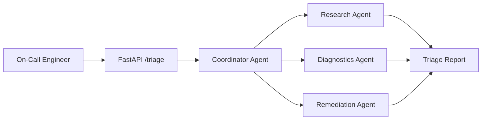
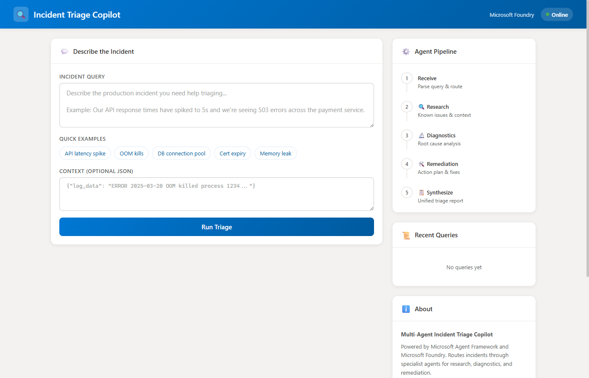
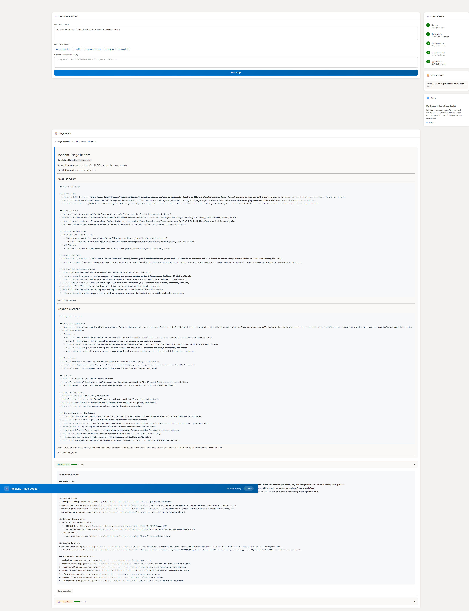

# Building a Multi-Agent Incident Triage Copilot with Microsoft Hosted Agents

*Write your agent in any framework → use AZD to deploy → run it as a hosted agent*

---

*How we built a production-ready multi-agent system that routes, diagnoses, and remediates production incidents, all orchestrated by the Microsoft Agent Framework.*

---

## The On-Call Problem

It's 3 AM. Your pager fires. An API is returning 503 errors. Customers are affected. You're staring at dashboards, grepping through logs, and trying to remember which runbook applies to this exact scenario, all while half-asleep.

What if you had an AI copilot that could instantly research the issue, analyse your logs, and hand you a prioritised remediation plan?

That's exactly what we built: a **Multi-Agent Incident Triage Copilot** powered by Microsoft Hosted Agents and orchestrated with the Microsoft Agent Framework. And in this post, I'll show you how you can build one too.

---

## Why Multi-Agent?

A single monolithic AI agent can answer questions, but incident triage requires **distinct expertise applied in sequence**:

1. **Research**: What's the known context? Are upstream services down? Has this happened before?
2. **Diagnostics**: What do the logs and metrics say? What's the root cause?
3. **Remediation**: What's the action plan? What's the rollback procedure? What PR do we ship?

Each of these is a different skill that benefits from different tools, different system prompts, and different reasoning strategies. A multi-agent architecture lets us decompose the problem and have specialists collaborate through shared context, just like a real incident response team.

```
User Query → Coordinator → Research Agent → Diagnostics Agent → Remediation Agent → Triage Report
                              (Bing)          (Code Interpreter)   (Plan Generator)
```

---

## The Architecture

Our copilot follows a **coordinator pattern**: a single orchestrator routes queries to specialist agents based on intent detection, then synthesises the results into a unified report.



### Key Design Decisions

| Decision | Why |
|---|---|
| **Sequential pipeline** | Each agent builds on the previous agent's findings: research informs diagnostics, diagnostics informs remediation |
| **Shared context dict** | A simple Python dictionary flows through the pipeline, accumulating findings |
| **Local + Foundry modes** | Run locally with heuristic responses for development; deploy to Microsoft Foundry for real AI model calls |
| **Keyword-based routing** | Fast, deterministic, and testable: the coordinator routes based on query keywords |
| **Correlation IDs** | Every request gets a unique ID that flows through all agent calls for end-to-end tracing |

---

## Building the Agents

### The Base Agent Pattern

Every specialist extends a simple abstract base class:

```python
class BaseSpecialistAgent(ABC):
    role: AgentRole
    prompt_file: str

    @abstractmethod
    async def run(
        self,
        query: str,
        shared_context: dict,
        correlation_id: str,
        client: Optional[object] = None,
    ) -> AgentResult:
        """Execute specialist analysis and return findings."""
```

This gives us a consistent interface: the coordinator can invoke any agent the same way. Each agent receives the query, the accumulated shared context, a correlation ID for tracing, and an optional Microsoft Foundry client for cloud-powered reasoning.

### The Research Agent

The Research Agent is always invoked first. When deployed to Microsoft Foundry, it uses **Bing Grounding** to search the web for known issues, service status pages, and relevant documentation. Bing Grounding is enabled by adding a `BingLLMSearch` connection to your Foundry project (see the [Enable Bing Grounding](README.md#enable-bing-grounding-live-web-search) section in the README for setup):

```python
class ResearchAgent(BaseSpecialistAgent):
    role = AgentRole.RESEARCH

    async def run(self, query, shared_context, correlation_id, client=None):
        if client is not None:
            content = await self._run_with_foundry(query, shared_context, client)
            tools_used = ["bing_grounding"]
        else:
            content = self._run_local(query, shared_context)
            tools_used = ["local_heuristic"]

        # Share findings with downstream agents
        shared_context["research_findings"] = content
        return AgentResult(agent=self.role, content=content, tools_used=tools_used)
```

The key insight: `shared_context["research_findings"]` makes the research output available to every subsequent agent. The Diagnostics Agent can cross-reference its log analysis with known issues. The Remediation Agent can factor in existing workarounds.

### The Diagnostics Agent

When the query contains error-related keywords (log, error, exception, OOM, timeout, etc.) or when log data is provided in the context, the Diagnostics Agent is activated. In Microsoft Foundry mode, it uses **Code Interpreter** to run Python analysis on the log data:

```python
class DiagnosticsAgent(BaseSpecialistAgent):
    role = AgentRole.DIAGNOSTICS

    async def run(self, query, shared_context, correlation_id, client=None):
        log_data = shared_context.get("log_data", "")
        research = shared_context.get("research_findings", "")

        if client is not None:
            content = await self._run_with_foundry(query, log_data, research, shared_context, client)
        else:
            content = self._run_local(query, log_data, research)

        shared_context["diagnostics_findings"] = content
        return AgentResult(agent=self.role, content=content)
```

### The Remediation Agent

The Remediation Agent takes everything from Research and Diagnostics and produces an actionable plan:

- **Immediate actions** (0-30 minutes): What to do right now
- **Short-term fixes** (30 min - 4 hours): The PR to ship
- **Long-term improvements**: Post-incident follow-ups

---

## The Coordinator: Intent-Based Routing

The Coordinator is the brain of the system. It decides which agents to invoke based on query analysis:

```python
def _detect_specialists(query: str, context: Optional[dict]) -> list[AgentRole]:
    specialists = [AgentRole.RESEARCH]  # Always run research

    if any(kw in query.lower() for kw in DIAGNOSTICS_KEYWORDS):
        specialists.append(AgentRole.DIAGNOSTICS)

    if any(kw in query.lower() for kw in REMEDIATION_KEYWORDS):
        specialists.append(AgentRole.REMEDIATION)

    # Complex queries get all specialists
    if len(specialists) == 1 and len(query.split()) > 15:
        specialists.extend([AgentRole.DIAGNOSTICS, AgentRole.REMEDIATION])

    return specialists
```

This is intentionally simple: keyword matching is fast, deterministic, and easily testable. For production, you could replace this with an LLM-based intent classifier, but for incident triage, explicit keyword routing gives you predictable behaviour under pressure.

---

## The Web UI

We built a responsive web interface directly into the FastAPI server, served as static files. No separate frontend build step required.



The UI features:
- **Quick example chips**: Pre-built incident scenarios for one-click testing
- **Optional JSON context**: Paste log snippets or metrics directly
- **Real-time pipeline visualisation**: Watch agents activate as the triage progresses
- **Expandable agent cards**: Drill into each agent's findings with confidence scores
- **Query history**: Revisit past triage reports without re-running



Each agent result includes a **confidence score** and a list of **tools used**, giving you transparency into how the triage was performed.

---

## Local Mode vs. Microsoft Foundry Mode

One of the most important design decisions: the copilot works **without any cloud dependencies** in local mode.

| Capability | Local Mode | Microsoft Foundry Mode |
|---|---|---|
| **Research** | Structured investigation checklist | Live web search via Bing Grounding |
| **Diagnostics** | Pattern-based log analysis | Python execution via Code Interpreter |
| **Remediation** | Template-based runbooks | AI-powered plan generation |
| **Cost** | Free | Azure consumption-based |
| **Setup** | `python -m src` | `azd up` |

This means you can develop, test, and iterate on your agent pipeline entirely locally, then deploy to Microsoft Foundry when you're ready for real AI model calls.

---

## Deploying with azd

The Azure Developer CLI makes deployment a single command:

```bash
# Initialize the agent project
azd ai agent init

# Deploy everything: infrastructure + container + agent registration
azd up
```

Behind the scenes, `azd up`:
1. Provisions a Microsoft Foundry Hub + Project
2. Configures the GPT-4o model deployment (as defined in `agent.yaml`)
3. Creates an Azure Container Registry and Container App
4. Sets up a Managed Identity with least-privilege RBAC (no API keys!)
5. Builds and pushes the Docker image
6. Registers the agent as a Microsoft Foundry Hosted Agent

After deployment, test with:

```bash
azd ai agent invoke --message "API latency spike with 503 errors"
```

---

## Testing Strategy

We invested heavily in testing because multi-agent systems need confidence at every layer:

```
tests/
├── test_models.py        # Pydantic model validation (8 tests)
├── test_routing.py       # Coordinator routing logic (11 tests)
├── test_agents.py        # Individual agent behaviour (8 tests)
├── test_coordinator.py   # Full pipeline integration (5 tests)
├── test_api.py           # HTTP endpoint tests (7 tests)
└── e2e_test.py           # Live server E2E (9 tests)
```

The routing tests are especially valuable: they verify that specific keywords trigger the correct specialist agents, giving you confidence that your intent detection is working correctly.

---

## What You Can Build

This sample is a starting point. Here are some ideas for extending it:

### Add a New Specialist Agent

Create `src/agents/cost_agent.py` that analyses the cost impact of an incident, how much revenue is being lost per minute, what's the blast radius in terms of affected customers.

### Add Custom Tools

Give agents access to your internal APIs: PagerDuty for incident history, Datadog for metrics, GitHub for recent PRs and deployments.

### Connect to Your Observability Stack

Replace the local log analysis with queries to your actual Application Insights, Datadog, or Elasticsearch cluster.

### Build a Slack/Teams Integration

Wrap the `/triage` API in a bot that responds to incident channels automatically.

---

## Key Takeaways for AI Developers

1. **Multi-agent beats monolithic**: Decompose complex tasks into specialist agents with clear responsibilities and shared context.

2. **Design for local-first**: Build your agent pipeline to work without cloud dependencies. It makes development 10x faster and testing 100x easier.

3. **Shared context is the glue**: A simple dictionary flowing through the pipeline lets each agent build on prior findings. No complex message bus required.

4. **Test your routing**: The coordinator's routing logic is the most critical piece. Test it thoroughly with explicit keyword matching before moving to LLM-based intent detection.

5. **Managed Identity everywhere**: No API keys, no connection strings, no secrets in code. Microsoft Foundry + Managed Identity gives you secure-by-default.

6. **Correlation IDs from day one**: When three agents are processing a query, you need a single ID that traces through the entire pipeline. Add this from the start.

7. **The Microsoft Agent Framework makes it easy**: The SDK handles agent creation, thread management, tool invocation, and run processing. You focus on the prompts and orchestration logic.

---

## Get Started

```bash
# Clone the sample
git clone https://github.com/leestott/incident-triage-copilot.git
cd incident-triage-copilot

# Set up and run locally
python -m venv .venv && .venv\Scripts\activate
pip install -r requirements.txt
python -m src

# Open the UI
# → http://localhost:8080
```

The copilot is ready to triage your first incident. Try clicking "API latency spike" and hitting **Run Triage** to see the multi-agent pipeline in action.

---

## Resources

- [Microsoft Foundry Hosted Agents](https://learn.microsoft.com/azure/ai-services/agents/concepts/hosted-agents)
- [Microsoft Agent Framework for Python](https://learn.microsoft.com/azure/ai-services/agents/)
- [Azure Developer CLI: AI Agent Extension](https://learn.microsoft.com/azure/developer/azure-developer-cli/ai-agent-extension)
- [Microsoft Foundry Documentation](https://learn.microsoft.com/azure/ai-foundry/)

---

*Built with Microsoft Agent Framework, Microsoft Foundry, FastAPI, and a lot of on-call empathy.*
